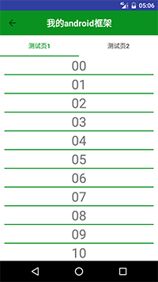
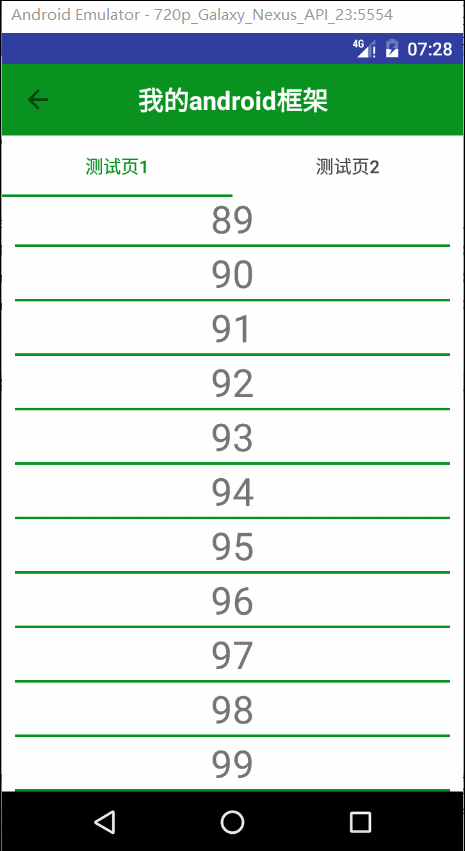
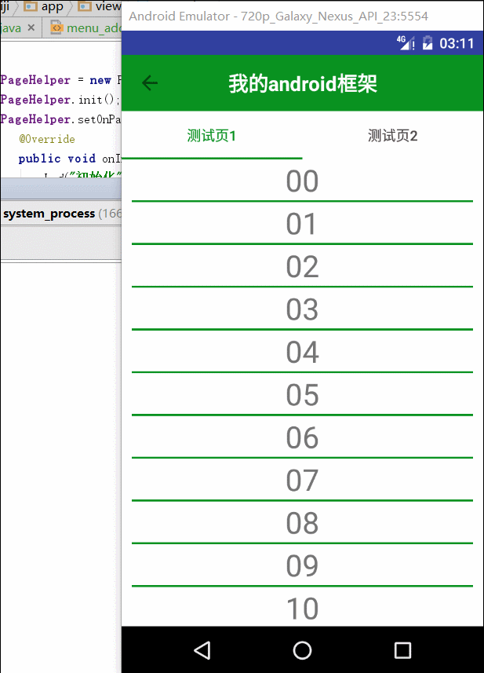
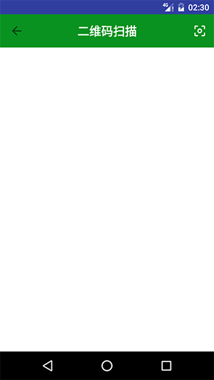

# CommonCore
android项目快速开发公共依赖
## UI部分
### 基础Activity
#### toolbar封装

**使用方法**
- 新建Activity继承BaseActivity
- 在activity的onCreate方法中使用如下方法设置标题栏名称
```java
setTitle("名称")
```
- 在activity的onCreate方法中使用mToolbar来进行其他操作，如在右侧添加按钮：
首先调用
``` java
setSupportActionBar(mToolbar);
```
在res/menu文件夹下创建menu_main.xml,内容如下
```xml
<menu xmlns:android="http://schemas.android.com/apk/res/android"
      xmlns:tools="http://schemas.android.com/tools"
      xmlns:app="http://schemas.android.com/apk/res-auto"
      tools:context=".activity.HomeActivity">
    <item android:id="@+id/action_scan"
          android:title="扫一扫"
          android:orderInCategory="80"
          android:icon="@drawable/ic_center_focus_weak"
          app:showAsAction="ifRoom">
    </item>
</menu>
```
在activity中重写onCreateOptionsMenu方法，加入menu_main
```java
    @Override
    public boolean onCreateOptionsMenu(Menu menu) {
        getMenuInflater().inflate(R.menu.menu_main, menu);
        return true;
    }
```
设置监听事件
```java
 mToolbar.setOnMenuItemClickListener(this);
 //=========================================
     @Override
    public boolean onMenuItemClick(MenuItem item) {
        switch (item.getItemId()) {
            case R.id.action_scan:
                Intent intent = new Intent(this, CaptureActivity.class);
                startActivityForResult(intent,REQUEST_CODE);
                break;
        }
        return false;
    }
```


#### 网络请求加载框

### TabLayout简单封装
#### TabLayout在布局文件使用
```xml
    <android.support.design.widget.TabLayout
        android:id="@+id/test_tab"
        android:layout_width="match_parent"
        android:layout_height="wrap_content"
        app:tabIndicatorColor="@color/colorPrimary"
        app:tabSelectedTextColor="@color/colorPrimary"
        app:tabTextColor="@color/text_color"
        app:tabBackground="@color/white">

    </android.support.design.widget.TabLayout>

    <android.support.v4.view.ViewPager
        android:id="@+id/test_vp"
        android:layout_width="match_parent"
        android:layout_height="match_parent"
        android:layout_below="@+id/test_tab">


    </android.support.v4.view.ViewPager>
```
#### TabLayout在代码中使用
```java
        mTabPageHelper = new TabPageHelper();
        mTabPageHelper.add("测试页1",new Test1View(this));
        mTabPageHelper.add("测试页2",new Test2View(this));

        mTestTab.setTabMode(TabLayout.MODE_FIXED);
        mTabPageHelper.initTab(mTestTab);
        SimplePageAdapter adapter = new SimplePageAdapter(mTabPageHelper);
        mTestVp.setAdapter(adapter);
        mTestTab.setupWithViewPager(mTestVp);
```
#### 效果展示

### RecyclerView下拉刷新，滑动分页，分页组件
* 下拉刷新使用官方组件SwipeRefreshLayout
* RecyclerView滑动分页使用第三方自定义Adapter组件BaseRecyclerViewAdapterHelper
* 分页组件为自己封装PageHelper
#### RecyclerView使用方法请自行百度
#### SwipeRefreshLayout使用方法
最外层使用SwipeRefreshLayout，将要下拉刷新的部分放到SwipeRefreshLayout内部。
```xml
   
        android:id="@+id/test_sr"
        android:layout_width="match_parent"
        android:layout_height="match_parent">

        
            android:id="@+id/test_rv"
            android:layout_width="match_parent"
            android:layout_height="match_parent"
            android:scrollbars="none">

        

    
```
在代码中使用：
```java
mTestSr.setOnRefreshListener(new SwipeRefreshLayout.OnRefreshListener() {
            @Override
            public void onRefresh() {
               //执行刷新操作
            }
        });
```
刷新完成调用：
```java
mTestSr.setRefreshing(false);
```

#### BaseRecyclerViewAdapterHelper使用方法
自定义adapter继承BaseQuickAdapter，泛型为RecyclerView需要的数据实体。在构造方法中调用
```java
super(R.layout.test1_item_layout,data);
```
第一个参数为子项的布局文件，第二个参数为数据列表。重写convert方法，使用baseViewHolder获取子项布局中的控件或者通过id为控件赋值。
```java
public class Test1Adapter extends BaseQuickAdapter{

    public Test1Adapter(List data) {
        super(R.layout.test1_item_layout,data);
    }

    @Override
    protected void convert(BaseViewHolder baseViewHolder, Test test) {
        baseViewHolder.setText(R.id.test_tv,test.getId());
    }
}
```
#### 分页组件使用
 * 分页组件具有的功能
   通过设置每页行数、总行数并且合理的初始化和分页调用实现自动计算当前页起始行，以及刷新完成、分页完成、全部数据加载完成的回调函数。
 * 在代码中创建并初始化,创建需要传入每一页行数
```java
  mPageHelper = new PageHelper(mContext,20);
  mPageHelper.init();
```
 * 下拉刷新时进行初始化
 * 设置分页监听
 

|     回调方法    | 方法说明 |
| --------------- | -------------- |
| oonInit()     | 分页初始化回调   |
| onRefresh()     | 下拉刷新回调   |
| loadMore()      | 分页加载回调   |
| onAllComplete() | 全部数据加载完成回调        |
* 开启分页功能,参数为每页行数，滑动到该行触发分页回调函数
```java
mAdapter.openLoadMore(mPageHelper.getPage_size());
```
* 分页加载操作,分页加载完成调用mPageHelper.pageLoad();
```java
   mAdapter.setOnLoadMoreListener(new BaseQuickAdapter.RequestLoadMoreListener() {
            @Override
            public void onLoadMoreRequested() {
                mTestRv.post(new Runnable() {
                    @Override
                    public void run() {
                        loadData(mPageHelper.getStart());
                        mPageHelper.pageLoad();
                    }
                });
            }
        });
```
* 数据加载完成，调用loadComplate()，传入数据总行数。
```java
mPageHelper.loadComplate(pb.getTotal());
```
```java
mPageHelper.setOnPageChangeListener(new PageHelper.OnPageChangeListener() {
            @Override
            public void onInit() {
                L.d("初始化");
                mAdapter.removeAllFooterView();
            }

            @Override
            public void onRefresh() {
                L.d("下拉刷新");
                mAdapter.setNewData(pb.getTList());
                mTestSr.setRefreshing(false);
                mPageHelper.setCurrentCounter(mAdapter.getData().size());
            }

            @Override
            public void loadMore() {
                L.d("加载更多");
                mAdapter.addData(pb.getTList());
                mTestSr.setRefreshing(false);
                mPageHelper.setCurrentCounter(mAdapter.getData().size());
            }

            @Override
            public void onAllComplete() {
                L.d("全部数据加载完成");
                mTestSr.setRefreshing(false);
                mAdapter.removeAllFooterView();
                mAdapter.loadComplete();
            }

        });
```
#### 效果展示

## 网络请求部分
### Retrofit使用封装

## 其他常用功能
### 二维码扫描
**使用方法**
#### 带按钮集成

* 继承ScanActivity，在toolbar上会有一个“扫一扫”按钮。
* 重写onScanResult方法获取扫描结果
#### 直接调用

* 打开扫描界面
```java
Intent intent = new Intent(this, CaptureActivity.class);
            startActivityForResult(intent,REQUEST_CODE);
```
* 获取扫描结果
```java
@Override
    protected void onActivityResult(int requestCode, int resultCode, Intent data) {
        switch (requestCode){
            case REQUEST_CODE:
                //扫码
                if(null!=data){
                    Bundle bundle = data.getExtras();
                    if(bundle==null){
                        return;
                    }
                    if(bundle.getInt(CodeUtils.RESULT_TYPE)==CodeUtils.RESULT_SUCCESS){
                        String result = bundle.getString(CodeUtils.RESULT_STRING);
                    }else if(bundle.getInt(CodeUtils.RESULT_TYPE) == CodeUtils.RESULT_FAILED){
                        T.showShort(this,"解析失败");
                    }
                }
                break;
        }
    }
```
* 说明：REQUEST_CODE为int 类型的标识，result为扫描二维码获取的内容
### PDA集成扫描头
[PDA集成扫描头配置说明](./mds/MotoScan.md)
