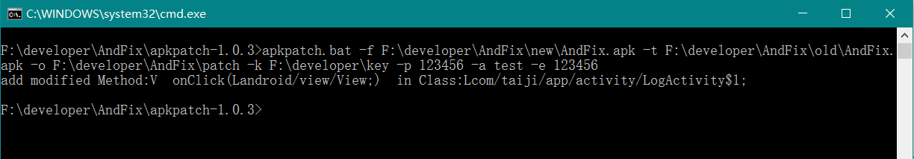

# AndFix热更新框架使用
## 工具下载
### 下载地址
[下载apkpatch](https://raw.githubusercontent.com/alibaba/AndFix/master/tools/apkpatch-1.0.3.zip)
### 命令说明
示例：apkpatch.bat -f F:\developer\AndFix\new\AndFix.apk -t F:\developer\AndFix\old\AndFix.apk -o F:\developer\AndFix\patch -k F:\developer\key -p 123456 -a test -e 123456

| 命令  | 说明    |
| --- | ------------ |
| -f  | 新apk路径    |
| -t  | 旧apk路径    |
| -o  | 补丁输出目录 |
| -k  | 签名文件目录 |
| -p  | 签名文件密码 |
| -a  | 签名文件别名 |
| -e  | 别名文件密码 |

