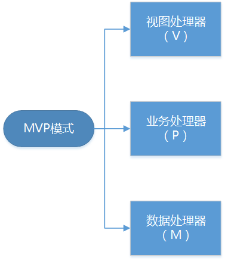

# Android MVP模式在项目中应用
## 概念说明

## 项目结构
### 说明图

### BasePresenter  基础业务处理器
```java
public interface BasePresenter {
    /**
     * 订阅
     */
    void subscribe();
    /**
     * 取消订阅
     */
    void unsubscribe();
}
```
### BaseView 基础视图处理器
```java
public interface BaseView<T> {
    void setPresenter(T presenter);
}
```
### contract 契约
```java
public interface XxxContract{

    interface View extends BaseView<Presenter>{
             //处理UI逻辑的方法
    }
    
    interface Presenter extends BasePresenter{
             //处理业务逻辑的方法
    }
}
```
### View部分Activity或Fragment
```java
public class XxxFragment implements XxxContract.View{
    private XxxContract.Presenter mPresenter;
    
    //为视图设置逻辑处理器
    @Override
    public void setPresenter(@NonNull XxxContract.Presenter presenter) {
        mPresenter = checkNotNull(presenter);
    }
 
    @Override
    public void onResume() {
        super.onResume();
        mPresenter.subscribe();
    }

    @Override
    public void onPause() {
        super.onPause();
        mPresenter.unsubscribe();
    }
}
```
### XxxPresenter逻辑处理器实现
```java
public class XxxPresenter implements XxxContract.Presenter{
       //视图处理器
       private final XxxContract.View mView;
       //数据源
       private final Repository mRepository;
       //程序调度器（负责制定程序执行线程）
       private final BaseSchedulerProvider mSchedulerProvider;

       public XxxPresenter(XxxContract.View mView,Repository mRepository,
                   BaseSchedulerProvider mSchedulerProvider){
        mRepository= checkNotNull(tasksRepository, "tasksRepository cannot be null");
        mView = checkNotNull(tasksView, "tasksView cannot be null!");
        mSchedulerProvider= checkNotNull(schedulerProvider, "schedulerProvider cannot be null");
       }

    @Override
    public void subscribe() {
        //订阅视图处理器（相当于初始化操作），在view的onResume（）方法执行
    }
    
    @Override
    public void unsubscribe() {
        //取消订阅视图处理器（相当于销毁操作），在view的onPause（）方法执行
    }
       
}
```
### 程序调度器
```java
public interface BaseSchedulerProvider {
    //创建并返回一个调度程序用于计算工作
    @NonNull
    Scheduler computation();

    //创建并返回一个调度程序用于执行异步阻塞任务
    @NonNull
    Scheduler io();
    //创建并返回一个调度程序用于执行Android UI任务
    @NonNull
    Scheduler ui();
}
```
### 数据源
```java
public interface XxxDataSource {

}
```
### 数据存储库
```java
public class XxxRepository implements XxxDataSource{
    //远程数据源
    @NonNull
    private final TasksDataSource mTasksRemoteDataSource;
    //本地数据源
    @NonNull
    private final TasksDataSource mTasksLocalDataSource;
    
    private TasksRepository(@NonNull TasksDataSource tasksRemoteDataSource,
                            @NonNull TasksDataSource tasksLocalDataSource) {
        mTasksRemoteDataSource = checkNotNull(tasksRemoteDataSource);
        mTasksLocalDataSource = checkNotNull(tasksLocalDataSource);
    }
}
```

